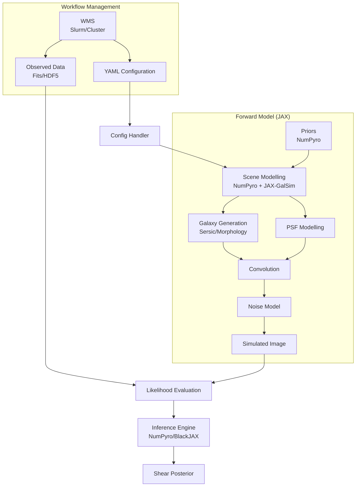

# SHINE (SHear INference Environment) Design Document

## 1. Introduction

### 1.1 Purpose
This document details the software architecture, design principles, and technical specifications for SHINE (SHear INference Environment). It serves as the primary reference for developers and contributors.

### 1.2 Scope
SHINE is a fully differentiable, forward-modeling pipeline for gravitational shear inference. It leverages JAX for automatic differentiation and GPU acceleration, `numpyro` for probabilistic programming, and `JAX-GalSim` for astronomical image simulation. The software is designed to handle data from major surveys (Euclid, LSST, MeerKAT) and aims to overcome limitations of traditional shear measurement methods (e.g., metacalibration) by directly inferring shear from pixel data within a Bayesian framework.

## 2. System Overview

### 2.1 Core Philosophy
SHINE treats shear measurement as a Bayesian inverse problem. Instead of measuring ellipticities and correcting for biases, SHINE generates forward models of the sky, convolved with the instrument response, and compares them to observed data to infer the posterior distribution of shear parameters.

### 2.2 Key Technologies
*   **JAX**: The backbone for computation, providing `jit` compilation, `vmap` vectorization, and `grad` for HMC inference.
*   **NumPyro**: Provides the probabilistic programming framework for defining hierarchical models and performing MCMC inference (NUTS/HMC).
*   **JAX-GalSim**: A JAX port of GalSim used for differentiable galaxy profile rendering and PSF convolution.
*   **BlackJAX**: (Optional/Alternative) Lower-level inference library if custom samplers are needed beyond NumPyro's offerings.

### 2.3 Architecture Diagram



## 3. Detailed Component Design

### 3.1 Configuration Handler
**Responsibility**: Parse YAML configuration files and validate inputs.
**Implementation**:
*   Uses `pydantic` or standard `yaml` libraries for robust validation.
*   Converts physical units (e.g., arcsec to radians) to internal consistency.
*   **Key Config Sections**: `Scene`, `PSF`, `Survey` (Euclid/LSST/MeerKAT), `Inference`, `Compute`.
*   **GalSim Compatibility**: Supports standard GalSim YAML structure for defining scene components. Any parameter defined as a distribution (e.g., `Normal`, `LogNormal`) is automatically treated as a latent variable for inference.

### 3.2 Scene Modelling (`shine.scene_modelling`)
**Responsibility**: Define the generative model of the astronomical scene.
**Integration**:
*   **NumPyro Integration**: The core function is a `numpyro` model. It defines random variables for galaxy properties (flux, size, ellipticity, position) and global parameters (shear, PSF properties).
*   **Hierarchical Models**: Supports partial pooling for galaxy populations (e.g., drawing individual galaxy Sersic indices from a population-level distribution).
*   **JAX-GalSim Usage**: Inside the model, `jax_galsim` objects (`Sersic`, `Gaussian`, `Shear`) are created using the sampled parameters.
    *   *Limitation Handling*: Since `jax_galsim` objects are immutable, the pipeline must be purely functional. No in-place modifications.
    *   *Vectorization*: Uses `jax.vmap` or `numpyro.plate` to efficiently render thousands of galaxies.

**Code Structure Example**:
```python
def model(data, config):
    # Global Shear
    g1 = numpyro.sample("g1", dist.Normal(0, 0.05))
    g2 = numpyro.sample("g2", dist.Normal(0, 0.05))
    shear = jax_galsim.Shear(g1=g1, g2=g2)
    
    # Plate for N galaxies
    with numpyro.plate("galaxies", config.n_galaxies):
        flux = numpyro.sample("flux", dist.LogNormal(...))
        # ... other params ...
        
        # Deterministic transformation (rendering)
        # Note: This needs careful vectorization with JAX-GalSim
        image = render_scene(flux, ..., shear)
        
    numpyro.sample("obs", dist.Normal(image, sigma), obs=data)
```

### 3.3 Inference Engine (`shine.inference`)
**Responsibility**: Perform Bayesian inference to obtain posteriors.
**Methods**:
*   **NUTS (No-U-Turn Sampler)**: Default high-performance sampler provided by NumPyro.
*   **SVI (Stochastic Variational Inference)**: For faster, approximate results on large datasets.
*   **BlackJAX Integration**: Wrappers for BlackJAX samplers if specific HMC variations are required.
**Optimization**:
*   Uses `jax.jit` to compile the likelihood and gradient functions.
*   Supports reparameterization (e.g., `LocScaleReparam`) to improve geometry for hierarchical models.

### 3.4 Simulation & Data Interfaces (`shine.simulations`, `shine.data`)
**Responsibility**: Standardize input data from various sources.
**Modules**:
*   `euclid`: Handles Euclid-specific PSF models and pixel scales.
*   `lsst`: Handles LSST bands and observing conditions.
*   `radio`: Handles visibility data or dirty images (if operating in image plane) for MeerKAT.
**Abstraction**:
*   All modules return a standardized `Observation` object containing: `image_data`, `noise_map`, `psf_model`, `wcs`.

### 3.5 Morphology (`shine.morphology`)
**Responsibility**: Generate galaxy surface brightness profiles.
**Types**:
*   **Parametric**: Standard Sersic profiles via `jax_galsim`.
*   **Non-Parametric**:
    *   *VAE/GAN*: Generative models trained on high-resolution data (e.g., COSMOS) to produce realistic morphologies.
    *   *Basis Functions*: Shapelets or other basis sets if supported by JAX-GalSim.

### 3.6 Workflow Management System (WMS)
**Responsibility**: Orchestrate large-scale runs on HPC clusters.
**Features**:
*   **Patching**: Splits large survey fields into manageable patches.
*   **Job Submission**: Generates SLURM scripts.
*   **Monitoring**: Tracks job status and aggregates results.

## 4. Development & Standards

### 4.1 Code Standards
*   **Style**: Black, isort.
*   **Typing**: Full type hinting (PEP 484).
*   **Documentation**: Google-style docstrings, Sphinx + ReadTheDocs.
*   **Testing**: `pytest` for unit tests. `chex` for JAX-specific testing (array shapes, types).

### 4.2 JAX-GalSim Specifics
*   **RNG**: JAX uses a functional PRNG. `jax_galsim`'s RNG handling must be carefully managed to ensure reproducibility, especially within `numpyro` models which manage their own RNG keys.
*   **Performance**: Avoid Python loops in the rendering path. Use `vmap` or `scan`.

### 4.3 Verification Strategy
*   **Unit Tests**: Verify individual components (e.g., Sersic profile generation matches analytical expectations).
*   **Integration Tests**: End-to-end run on a small synthetic patch.
*   **Validation**:
    *   *Self-Consistency*: Generate data with known shear, infer it back, check if truth is within posterior credible intervals.
    *   *Comparison*: Compare results with standard GalSim (non-JAX) for identical inputs to ensure numerical accuracy.

## 5. Roadmap
1.  **Phase 1**: Prototype with simple parametric models (Sersic) and constant PSF.
2.  **Phase 2**: Integration of realistic PSF models (Euclid/LSST specific).
3.  **Phase 3**: Non-parametric galaxy morphology (VAE/Diffusion).
4.  **Phase 4**: Large-scale validation on Flagship/CosmoDC2 simulations.

## 6. End-to-End Usage Example

This section demonstrates the complete workflow from configuration to inference, highlighting the interaction between `shine` components.

### 6.1 GalSim-Compatible Configuration

SHINE adopts the GalSim YAML structure but interprets it in a probabilistic context.

> [!NOTE]
> **Standard GalSim vs. SHINE Extensions**:
> *   **Standard**: `image`, `psf`, `gal` top-level keys. Use of `type` to specify profiles (e.g., `Sersic`, `Gaussian`).
> *   **SHINE Extension**: In standard GalSim, defining a random distribution (e.g., `type: Normal`) draws a *single fixed value* for that simulation. In SHINE, this defines a **prior distribution** for a latent variable that will be inferred.

**Example Config (`configs/euclid_run.yaml`):**

```yaml
# Top-level simulation parameters (Standard GalSim)
image:
  pixel_scale: 0.1  # arcsec/pixel
  size_x: 64
  size_y: 64
  noise:
    type: Gaussian
    sigma: 1.0

# PSF Definition (Fixed for this example)
psf:
  type: Gaussian
  sigma: 0.1

# Galaxy Definition (Probabilistic)
gal:
  type: Sersic
  # Fixed parameter (Standard GalSim behavior)
  n: 4.0 
  
  # Probabilistic parameters (SHINE Interpretation: Latent Variables)
  flux:
    type: LogNormal
    mean: 1000.0
    sigma: 0.5
    
  half_light_radius:
    type: Uniform
    min: 0.1
    max: 1.0

  shear:
    type: G1G2
    g1: 
      type: Normal
      mean: 0.0
      sigma: 0.05
    g2: 
      type: Normal
      mean: 0.0
      sigma: 0.05
```

### 6.2 Main Execution Script

```python
# shine/main_example.py
import jax
from shine.config import ConfigHandler
from shine.scene import SceneBuilder
from shine.inference import HMCInference
from shine.data import DataLoader

def main():
    # 1. Load Configuration
    # Parses YAML, validates types, and converts units (e.g., arcsec -> radians)
    config = ConfigHandler.load("configs/euclid_run.yaml")
    
    # 2. Load Data
    # Returns a standardized Observation object containing:
    # - image: jax.numpy array of pixel data
    # - noise_map: variance map
    # - psf_model: JAX-GalSim PSF object or kernel
    # - wcs: World Coordinate System info
    observation = DataLoader.load(config.data_path)
    
    # 3. Build the Probabilistic Model
    # SceneBuilder initializes the NumPyro model function.
    # It pre-compiles JAX-GalSim components based on config.
    scene_builder = SceneBuilder(config)
    model_fn = scene_builder.build_model()
    
    # 4. Initialize Inference Engine
    # Sets up the NUTS sampler with specified parameters
    inference_engine = HMCInference(
        model=model_fn,
        num_warmup=config.inference.warmup,
        num_samples=config.inference.samples,
        num_chains=config.inference.chains,
        dense_mass=config.inference.dense_mass # Use dense mass matrix if correlated
    )
    
    # 5. Run Inference
    # Executes the MCMC chain.
    # Uses JAX's PRNGKey for reproducibility.
    print("Starting inference...")
    rng_key = jax.random.PRNGKey(42)
    results = inference_engine.run(
        rng_key=rng_key, 
        observed_data=observation.image,
        extra_args={"psf": observation.psf_model}
    )
    
    # 6. Analyze and Save Results
    # Results object contains posterior samples and convergence diagnostics (r_hat)
    print(f"Inferred Shear g1: {results.samples['g1'].mean():.5f} ± {results.samples['g1'].std():.5f}")
    print(f"Inferred Shear g2: {results.samples['g2'].mean():.5f} ± {results.samples['g2'].std():.5f}")
    
    results.save(config.output_path / "posterior.nc") # Save as NetCDF/ArviZ compatible

if __name__ == "__main__":
    main()
```

### 6.3 Internal Model Structure (`SceneBuilder`)

The `SceneBuilder` constructs the `numpyro` model by parsing the GalSim-style YAML.

```python
# Inside shine/scene/builder.py
import numpyro
import numpyro.distributions as dist
import jax.numpy as jnp
import jax_galsim as galsim

class SceneBuilder:
    def __init__(self, config):
        self.config = config

    def _parse_prior(self, name, param_config):
        """Helper to create NumPyro distributions from config."""
        if param_config['type'] == 'Normal':
            return numpyro.sample(name, dist.Normal(param_config['mean'], param_config['sigma']))
        elif param_config['type'] == 'LogNormal':
             return numpyro.sample(name, dist.LogNormal(jnp.log(param_config['mean']), param_config['sigma']))
        # ... other distributions ...

    def build_model(self):
        """Returns a callable model function for NumPyro."""
        
        def model(observed_data=None, psf=None):
            # --- 1. Global Parameters (Shear) ---
            # Parsed from config.gal.shear
            g1 = self._parse_prior("g1", self.config.gal.shear.g1)
            g2 = self._parse_prior("g2", self.config.gal.shear.g2)
            shear = galsim.Shear(g1=g1, g2=g2)
            
            # --- 2. Galaxy Population (Hierarchical) ---
            # We use a plate to assume independence between galaxies given global params
            n_galaxies = self.config.image.n_objects # Standard GalSim field
            
            with numpyro.plate("galaxies", n_galaxies):
                # Sample morphological parameters from config
                flux = self._parse_prior("flux", self.config.gal.flux)
                hlr = self._parse_prior("hlr", self.config.gal.half_light_radius)
                
                # Fixed parameter example
                n = self.config.gal.n 
                
                # Sample positions
                x = numpyro.sample("x", dist.Uniform(0, self.config.image.size_x))
                y = numpyro.sample("y", dist.Uniform(0, self.config.image.size_y))

            # --- 3. Differentiable Rendering (JAX-GalSim) ---
            # We define a helper to render a single galaxy
            def render_one_galaxy(flux, hlr, n, x, y):
                gal = galsim.Sersic(n=n, half_light_radius=hlr, flux=flux)
                gal = gal.shear(shear)        # Gravitational
                gal = galsim.Convolve([gal, psf])
                # Draw onto a stamp or full image (simplified here)
                return gal.drawImage(nx=self.config.image.size_x, 
                                     ny=self.config.image.size_y, 
                                     scale=self.config.image.pixel_scale,
                                     offset=(x, y)).array

            # Vectorize rendering over all galaxies using vmap
            # This is crucial for performance in JAX
            galaxy_images = jax.vmap(render_one_galaxy)(flux, hlr, n, x, y)
            
            # Sum all galaxy images to get the model scene
            model_image = jnp.sum(galaxy_images, axis=0)
            
            # --- 4. Likelihood ---
            # Compare model image to observed data
            sigma = self.config.image.noise.sigma
            numpyro.sample("obs", dist.Normal(model_image, sigma), obs=observed_data)
            
        return model
```