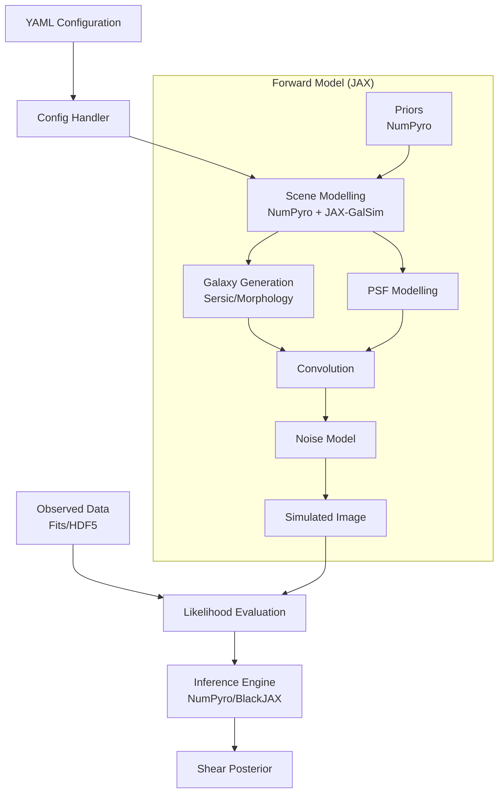

# Architecture

SHINE treats shear measurement as a Bayesian inverse problem. Instead of measuring
galaxy ellipticities and correcting for biases, it generates forward models of the
sky, convolves with the instrument response, and compares to data to infer the
posterior distribution of shear parameters.

## Pipeline Overview

## Key Technologies

| Technology | Role |
|------------|------|
| **JAX** | JIT compilation, `vmap` vectorization, `grad` for HMC |
| **NumPyro** | Probabilistic programming: hierarchical models, NUTS/HMC |
| **JAX-GalSim** | Differentiable galaxy profile rendering and PSF convolution |
| **Pydantic** | Configuration validation and type safety |
| **ArviZ** | Posterior analysis and diagnostics |

## Core Components

### Configuration (`shine.config`)

Parses YAML configuration files using Pydantic models. Validates inputs and converts
the GalSim-compatible config into typed Python objects. Parameters defined as
distributions automatically become latent variables in the probabilistic model.

### Scene Builder (`shine.scene`)

Constructs the NumPyro generative model from configuration. The `SceneBuilder`:

1. Translates config distributions into NumPyro `sample` sites (priors)
2. Renders galaxies using JAX-GalSim inside the model function
3. Convolves with the PSF and adds noise to form the likelihood
4. Uses `jax.vmap` for vectorized rendering over galaxies

The forward model is fully differentiable, enabling gradient-based samplers.

### Inference Engine (`shine.inference`)

Runs Bayesian inference using one of three methods, configured via YAML:

- **NUTS**: MCMC sampling with the No-U-Turn Sampler, optionally preceded by MAP initialization.
- **MAP**: Maximum a posteriori point estimation (fast, no posterior samples).
- **VI**: Variational Inference with an AutoNormal guide (approximate posterior).

All three methods return ArviZ `InferenceData` objects, so the downstream
pipeline (extraction, diagnostics, plots) works uniformly.

### Data Loading (`shine.data`)

Handles both observed data (FITS files) and synthetic data generation. When no
`data_path` is specified, generates synthetic observations using GalSim with
the config parameters.

### Galaxy and PSF Utilities

`shine.galaxy_utils` and `shine.psf_utils` provide factory functions that create
GalSim and JAX-GalSim objects from configuration, supporting Sersic, Exponential,
Gaussian, and Moffat profiles.

## Validation Pipeline

The `shine.validation` module provides a three-stage bias measurement infrastructure:

1. **Stage 1 (Run)**: Generate synthetic data with known shear, run MCMC, save posteriors
2. **Stage 2 (Extract)**: Load posteriors, extract convergence diagnostics and shear estimates
3. **Stage 3 (Stats)**: Compute multiplicative/additive bias, check acceptance criteria

See the [Validation overview](validation/index.md) for details.

## Design Principles

- **Purely functional**: JAX-GalSim objects are immutable; the pipeline avoids side effects
- **Vectorized**: `jax.vmap` and `numpyro.plate` replace Python loops in rendering paths
- **JIT-compiled**: likelihood and gradient functions are compiled with `jax.jit`
- **Config-driven**: the same YAML drives simulation and inference
- **Reproducible**: functional PRNG keys ensure deterministic results
