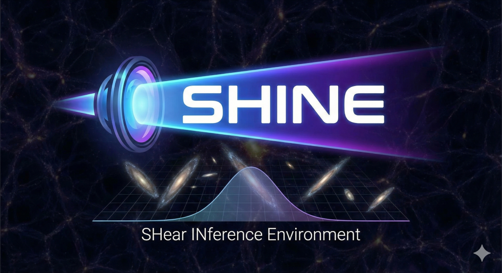

# SHINE: SHear INference Environment

<div align="center">
  
</div>

**A JAX-powered framework for probabilistic shear estimation in weak gravitational lensing.**

---

## Overview

SHINE treats shear measurement as a Bayesian inverse problem. Instead of measuring
ellipticities and correcting for biases, SHINE generates forward models of the sky,
convolves with the instrument response, and compares to observed data to infer
posterior distributions of shear parameters.

Built on **JAX**, it leverages automatic differentiation and JIT compilation for
fast, GPU-accelerated inference using **NumPyro** and **JAX-GalSim**.

## Key Features

- **JAX-powered** -- automatic differentiation and JIT compilation for optimal performance
- **Probabilistic inference** -- full posterior distributions via NUTS/HMC
- **Differentiable rendering** -- JAX-GalSim for end-to-end gradient flow
- **GPU acceleration** -- seamless GPU support for large-scale analyses
- **Config-driven** -- GalSim-compatible YAML with probabilistic extensions
- **Validation pipeline** -- built-in bias measurement infrastructure

## Quick Start

```bash
# Install
git clone https://github.com/CosmoStat/SHINE.git
cd SHINE
pip install -e .

# Run inference
python -m shine.main --config configs/test_run.yaml
```

See the [Getting Started](getting-started.md) guide for a full walkthrough.

## Project Status

!!! warning "Early Development"
    SHINE is under active development. APIs may change between releases.

## Organization

Born at [CosmoStat](https://www.cosmostat.org/) (CEA / CNRS), built for the astro community.

Licensed under [MIT](https://github.com/CosmoStat/SHINE/blob/main/LICENSE).
